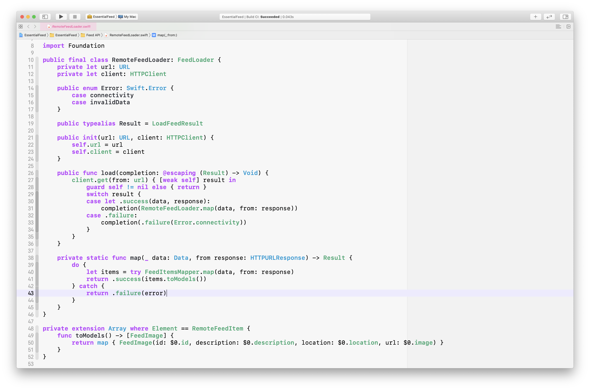
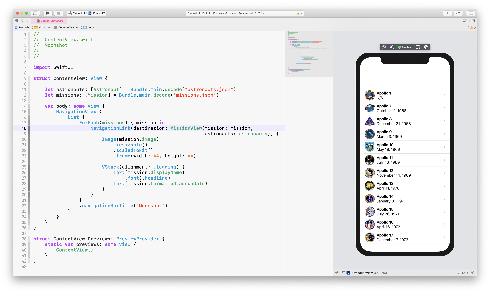
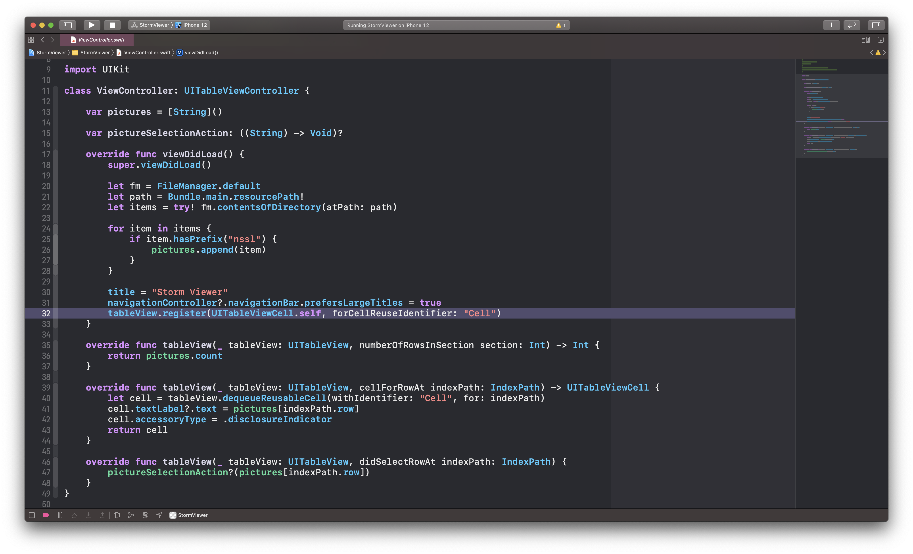
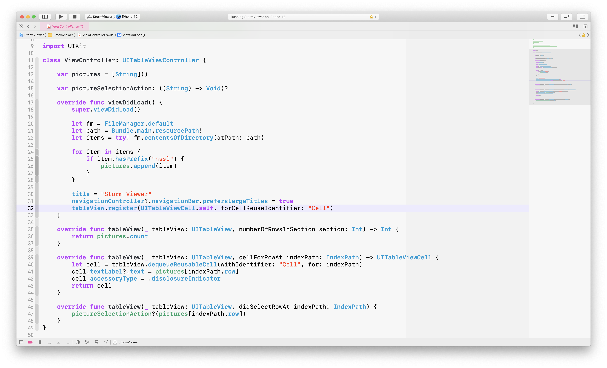
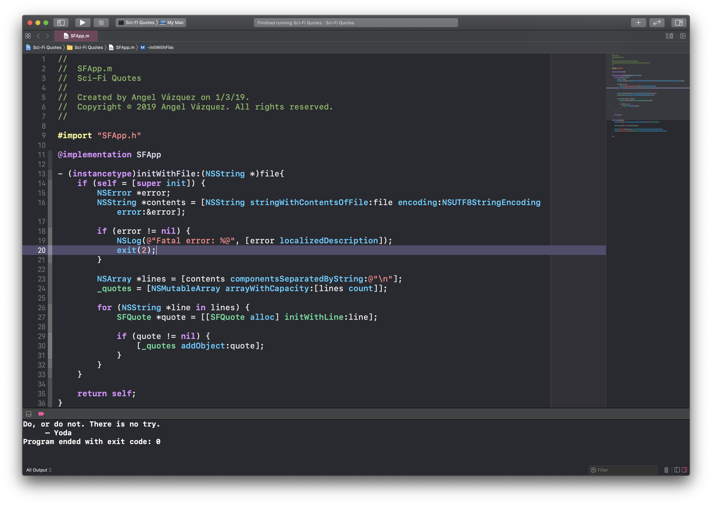
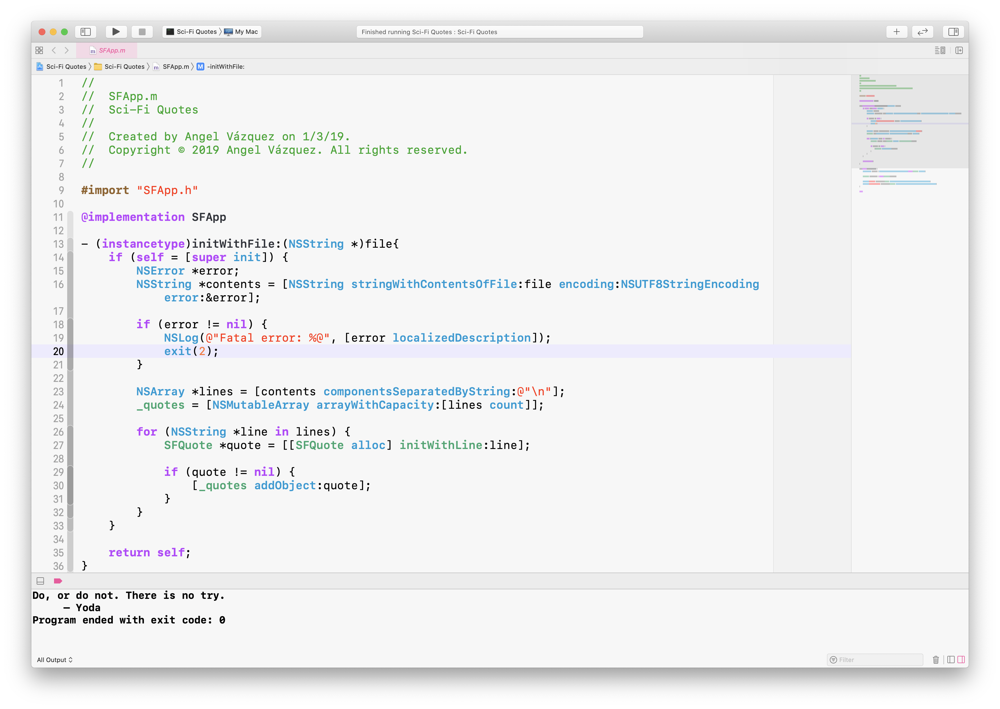
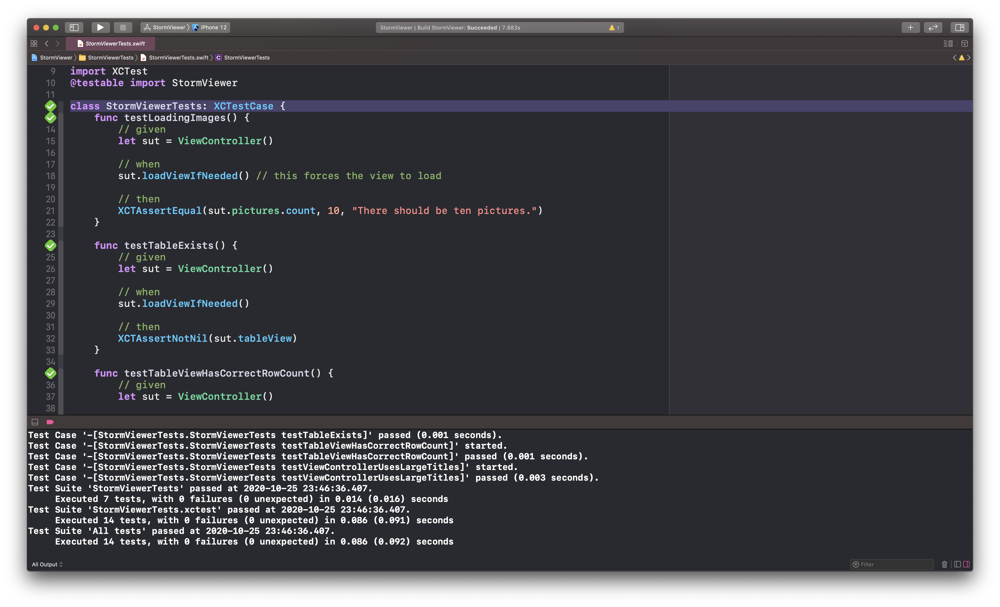
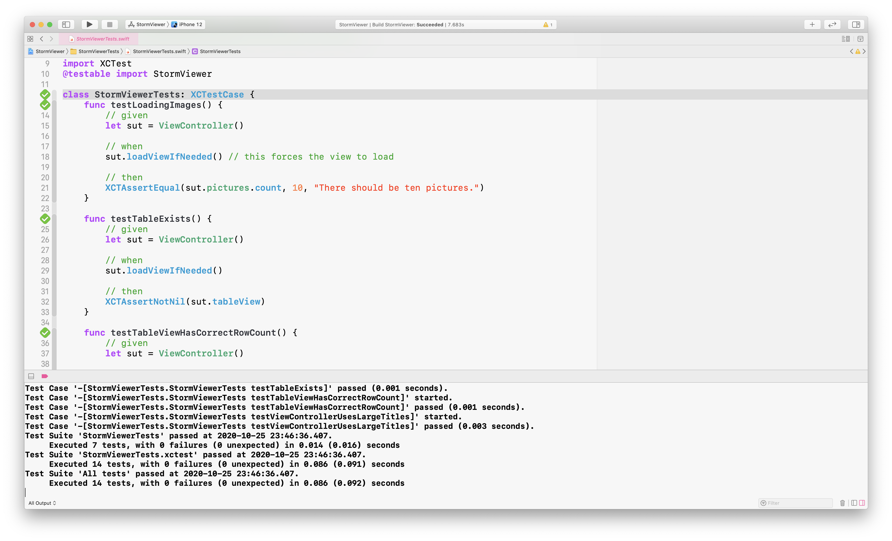

# 🌟 Neon Glow 🌟

This repository contains my personal Xcode theme "*Neon Glow*" for both light and dark configurations. Feel free to use, modify or sharing it with others. 

## Screenshots

### Dark Version

  

### Light Version

  

### Extra screenshots

<table>
  <tr>
    <th>Dark version</th>
    <th>Light version</th>
  </tr>
  <tr>
    <td>
      
    </td>
    <td>
      
    </td>
  </tr>
  <tr>
    <td>
      
    </td>
    <td>
      
    </td>
  </tr>
  <tr>
    <td>
      
    </td>
    <td>
      
    </td>
  </tr>
  <tr>
    <td>
      
    </td>
    <td>
      
    </td>
  </tr>
</table>