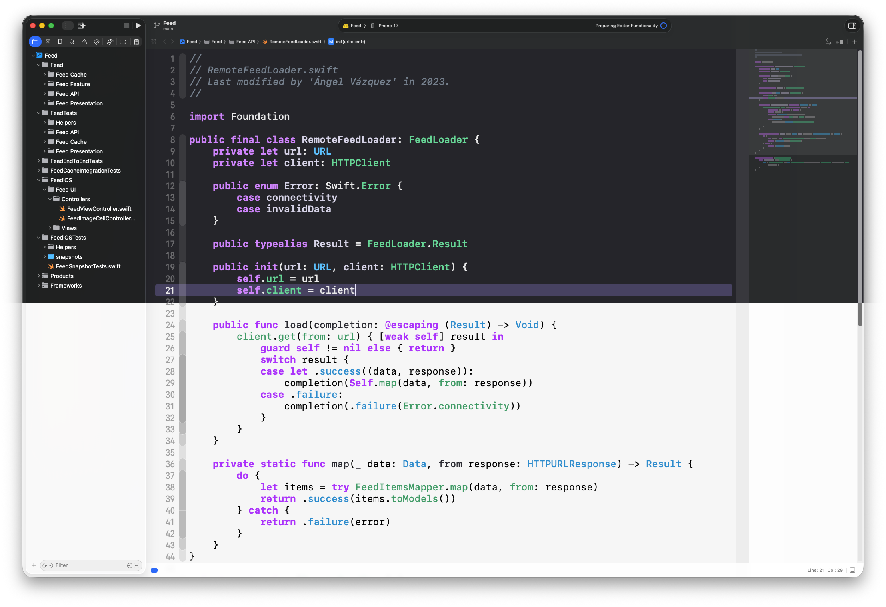
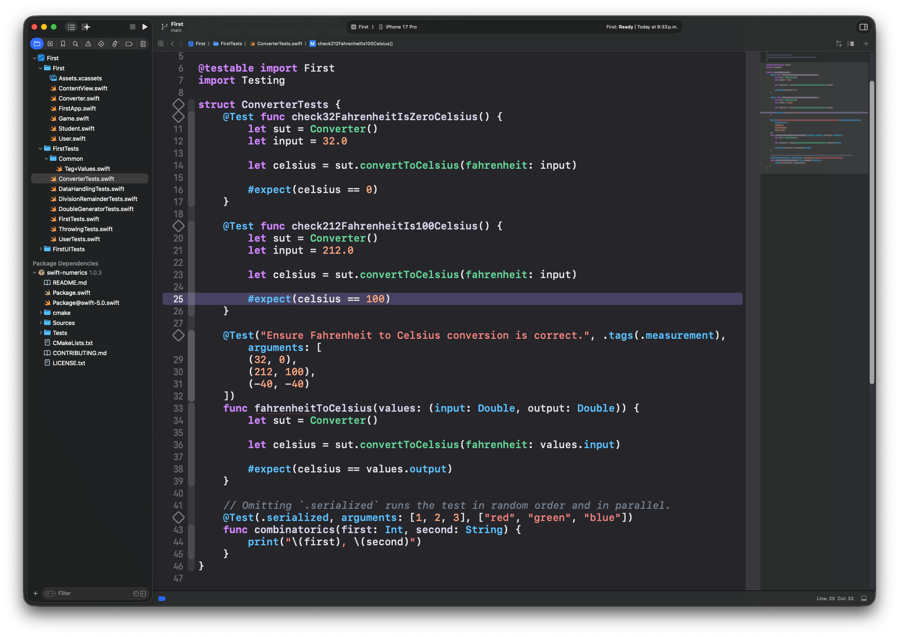
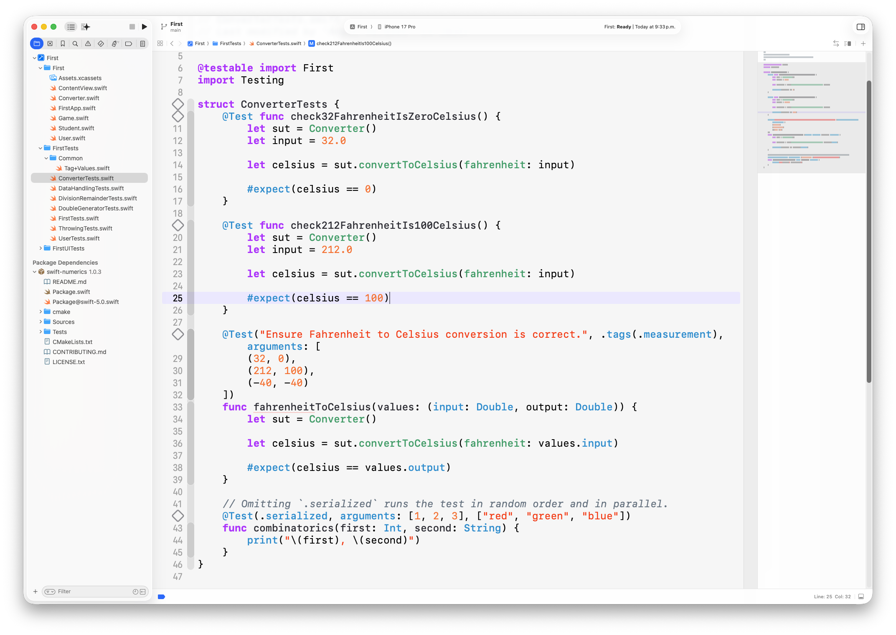
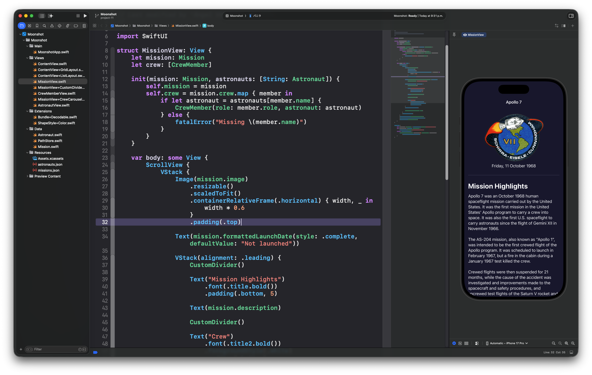
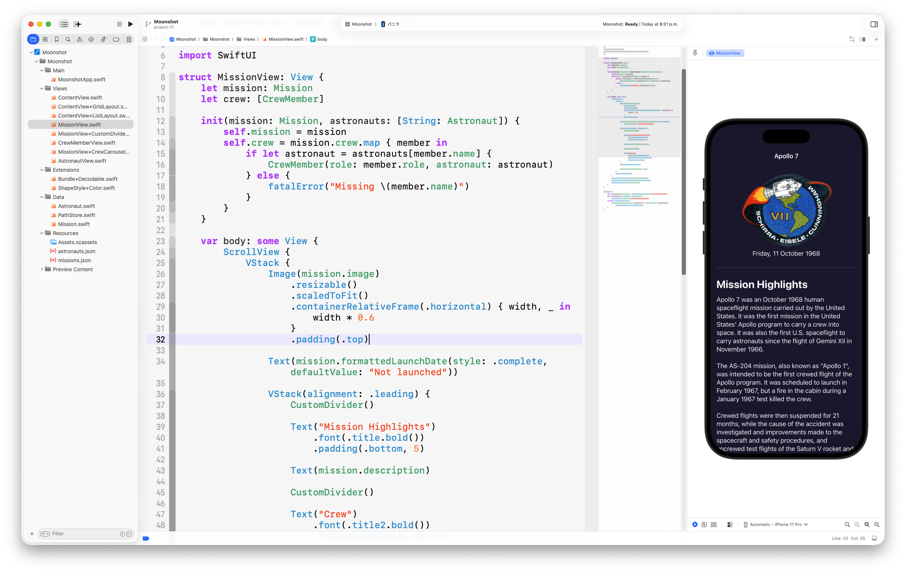
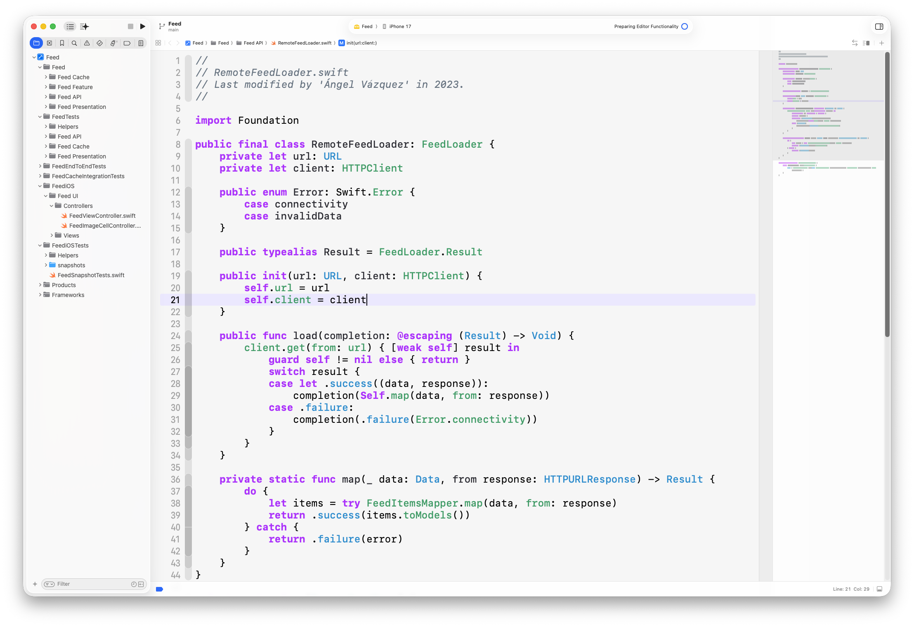

# 🌟 Neon Glow 🌟

This repository contains my personal Xcode theme **Neon Glow** for both light and dark configurations. Feel free to use, modify or sharing it with others. 

<p align="center">
 <a href="img/main.png">
    
  </a>
</p>

**Note**: The theme uses the default font which currently is SFMono font for both source editor and console output. **The current font size is 24 (source editor) and 22 (console)**, you can resize them with <kbd>⌘+</kbd> (bigger fonts) and <kbd>⌘-</kbd> (smaller fonts) instead of resizing all fonts manually.

## Installation

Each method requires you to **close any running instance of Xcode** as Xcode loads all installed custom themes when it starts.

### Using the `install.sh` script

1. Clone the repository
2. Open the terminal and navigate to the root of the repository. 
3. Run the `install.sh` script.

```bash
\.install.sh
```

4. Open Xcode, then select <kbd>Xcode > Preferences</kbd> in the menu bar or use the <kbd>⌘,</kbd> keyboard shortcut.
5. Select the <kbd>Themes</kbd> tab. You'll be able to select any version of **Neon Glow** from the list of installed themes.

### Copying the themes manually

1. Clone or download the repository in a ZIP file and unzip it. 
2. Open the Finder and select <kbd>Go > Go to Folder...</kbd> on the menu bar (shortcut <kbd>⇧⌘G</kbd>).
3. Type `~/Library/Developer/Xcode/UserData/` and select <kbd>Go</kbd>.
4. Create a new folder called `FontAndColorThemes` if it doesn't exist inside the `UserData` folder.
5. Drag and drop `Neon Glow (Dark).xccolortheme` and `Neon Glow (Light).xccolortheme` inside the `FontAndColorThemes` folder.
6. Open Xcode, then select <kbd>Xcode > Preferences</kbd> in the menu bar or use the <kbd>⌘,</kbd> keyboard shortcut.
7. Select the <kbd>Themes</kbd> tab. You'll be able to select any version of **Neon Glow*** from the list of installed themes.

### Screenshots

<table>
  <tr>
    <th>Dark version</th>
    <th>Light version</th>
  </tr>
  <tr>
    <td>
      <a href="img/dark01.png">
        
      </a>
    </td>
    <td>
      <a href="img/light01.png">
        
      </a>
    </td>
  </tr>
  <tr>
    <td>
      <a href="img/dark02.png">
        
      </a>
    </td>
    <td>
      <a href="img/light02.png">
        
      </a>
    </td>
  </tr>
  <tr>
    <td>
      <a href="img/dark03.png">
        
      </a>
    </td>
    <td>
      <a href="img/light03.png">
        
      </a>
    </td>
  </tr>
</table>
